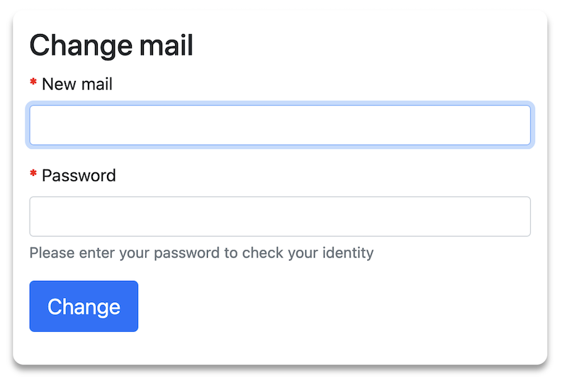
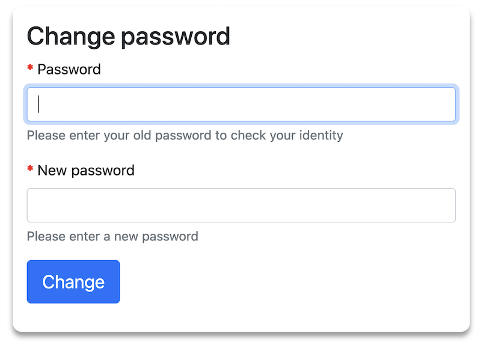

# SvcProfileBundle

 
 
 

:warning: **Breaking Change in Version 6.3.0:**  
Starting with version 6.3.0, the bundle uses PHP format for route configuration instead of YAML. You need to import the routes manually in your project. See [Usage](docs/usage.md) for updated installation instructions.
 

:warning: **Attention:**  
From version 6.0 the bundle works only with Symfony >=6.4. 
The bundle uses "symfony/ux-toggle-password" for password visibility toggle. For installations without this requirement, please use a version <6.0.
 

From version 4.0 the bundle works only with Symfony >=6.1, because the new Bundle Configuration System is used. 

Please use version 3.x for older Symfony installations. 

## Bundle with two functions:
  * Change user password (with email information)
  * Change user email address (with email confirmation)

## Security Features
- **XSS Protection**: All user input is properly validated and sanitized
- **Email Validation**: Comprehensive validation including disposable email domain blocking
- **Token Security**: Secure token generation with HMAC-SHA256 hashing
- **Rate Limiting Ready**: Designed to work with rate limiting implementations

 

### Documentation
* [Installation](docs/installation.md)
* [Usage](docs/usage.md)
* [Migration Guide](docs/migration.md) - **Important for v6.3.0+ upgrades**

 

### Screenshots

#### Change mail form

 

#### Change password form

